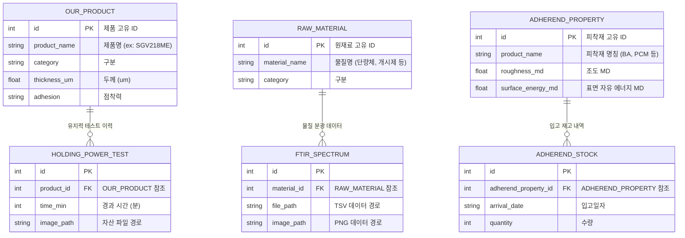

# SG_DB: 세계화학공업(주) 데이터 자산 및 모델 가중치 저장소

  

## 1. 개요
`SG_DB`는 SG_proj 파이프라인의 모든 시스템 모듈(001~015)에서 참조하는 마스터 데이터 웨어하우스(Data Warehouse)입니다. 
기존 `SG_proj_004` 모듈 내에 혼재되어 있던 원본 데이터(`raw_data`)와 데이터베이스 클러스터를 안전하게 보호하고 물리적으로 분리하기 위해 구축되었습니다.

> [!WARNING]
> 본 레포지토리는 Public으로 공개되지만, 보안 정책에 따라 실제 데이터가 담긴 `raw_data/` 폴더와 `postgres_data/` 바이너리 파일들은 `.gitignore`를 통해 업로드되지 않도록 차단되어 있습니다.
> 시스템을 처음 구축하는 개발자는 관리자에게 별도로 데이터 자산을 인계받아 이 폴더 내에 배치해야 합니다.

## 2. 데이터베이스 구성

본 저장소에 보관되는 메인 데이터베이스 엔진은 **PostgreSQL**입니다. 실제 바이너리 데이터 클러스터는 `postgres_data/` 폴더에 물리적으로 마운트되어 저장되며 영업/물성 기준 데이터와 인벤토리 정보가 정규화되어 담겨 있습니다. (기존 SQLite 파일은 안전을 위해 백업되었습니다.)

### 데이터베이스 ERD (Entity-Relationship Diagram)

아래는 `sg_proj_004.db` 내부 테이블 간의 스키마 구조 및 관계를 시각화한 ERD입니다.

## 3. 원본 데이터 세부 명세 (`raw_data`)

`raw_data/` 디렉토리에는 AI 학습 및 DB 구축의 기반이 되는 비정형/정형 데이터가 보관되어 있습니다.

1. **상용 제품 및 판별 기준 (엑셀)**
   - `세계화학공업(주) 제품분류_7.xlsx`: 자사 생산 제품의 스펙
   - `세계화학공업(주) 제품분류 260519ver1_판별기준.xlsx` 등

2. **재고 및 공정 이력 (엑셀/이미지)**
   - `피착제 입고 목록표 (AI용 정리본).xlsx`
   - 유지력 테스트 결과 이미지 자산 등

3. **원재료 물성 (비정형/측정치)**
   - `원재료 종류별 FT-IR 데이터` (.tsv 스펙트럼 수치 및 .png 그래프)

## 4. 모듈 연동 가이드

본 `SG_DB` 모듈은 자체적인 실행 코드를 갖지 않습니다. 데이터를 조회하고 시스템에 연동하기 위해서는 **`SG_proj_004` (API 게이트웨이) 모듈**을 실행해야 합니다.

- `SG_proj_004`를 Docker로 실행할 경우, `docker-compose.yml`에서 이 `SG_DB` 디렉토리를 볼륨 마운트(Volume Mount)하여 접근합니다.
- 로컬 개발 시에는 환경 변수 `DATABASE_URL`을 통해 이 저장소의 `.db` 파일을 바라보도록 설정됩니다.
